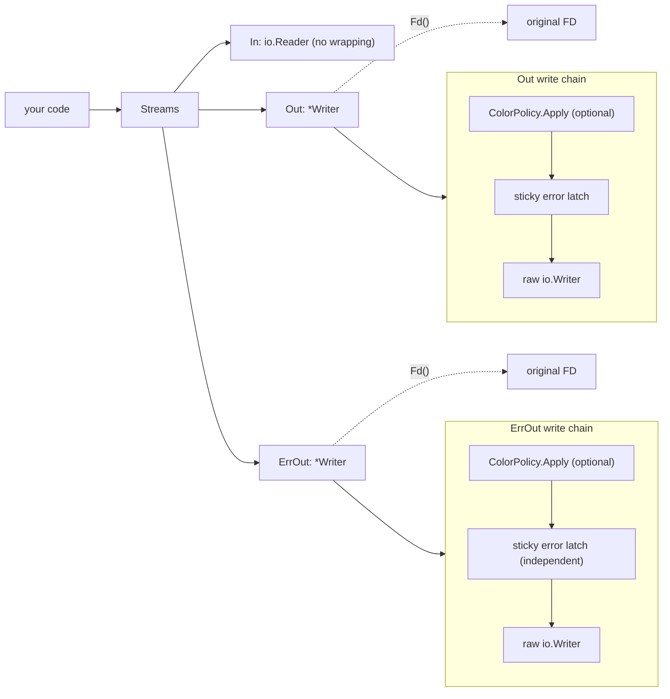

# termio

[](https://github.com/gopherly/termio/actions/workflows/ci.yml)
[](https://codecov.io/gh/gopherly/termio)
[](https://pkg.go.dev/gopherly.dev/termio)
[](https://goreportcard.com/report/gopherly.dev/termio)
[](LICENSE)
[](https://slack.com/app_redirect?channel=C0B50TDEKN2)

termio is a small, dependency-light bundle of terminal I/O primitives for Go
CLI programs. It gives you a standard way to handle input, output, and error
output, with TTY detection and optional color adaptation built in.

```bash
go get gopherly.dev/termio
```

> [!IMPORTANT]
> Requires Go 1.25 or later.

```go
import "gopherly.dev/termio"

s := termio.System()
fmt.Fprintln(s.Out, "hello, world")
```

## Why termio

- One type, `Streams`, bundles `In`, `Out`, and `ErrOut` together with TTY
  detection and terminal width. No setup needed for the common case.
- Dependency-light core. The `gopherly.dev/termio` package depends only on
  `golang.org/x/term`. Color support is opt-in through the `colorprofile`
  subpackage. Import the color adapter only when you need it; callers that do
  not import it never compile the charmbracelet dependency.
- Per-stream sticky errors. Each `Writer` latches its own first error. A broken
  pipe on `ErrOut` does not affect `Out`, and vice versa. No mainstream Go I/O
  bundle does this.
- FD preservation. `Writer.Fd()` returns the original file descriptor even after
  the color policy and error wrapper are stacked on top. Libraries like
  bubbletea, glamour, and lipgloss can detect the terminal through the wrapper
  without type assertions.
- Designed for testing. Swap in buffer-backed streams with one call. No daemon
  or OS dependency required.

## How it works



The core package (`gopherly.dev/termio`) has one non-stdlib dependency:
`golang.org/x/term`, used for TTY detection and terminal width queries.

The `colorprofile` subpackage (`gopherly.dev/termio/colorprofile`) is the only
place `github.com/charmbracelet/colorprofile` appears. Import it only when you
need color adaptation.

The `termiotest` subpackage (`gopherly.dev/termio/termiotest`) provides
buffer-backed helpers for unit tests.

## Contents

1. [Quick start](#quick-start)
2. [Sticky errors](#sticky-errors)
3. [TTY detection](#tty-detection)
4. [Terminal width](#terminal-width)
5. [Raw stream access](#raw-stream-access)
6. [Testing](#testing)
7. [Packages](#packages)
8. [Comparison](#comparison)
9. [Development](#development)
10. [Contributing](#contributing)
11. [Community](#community)
12. [License](#license)

## Quick start

### Without color

```go
package main

import (
    "fmt"
    "os"

    "gopherly.dev/termio"
)

func main() {
    s := termio.System()

    if s.IsInteractive() {
        fmt.Fprintln(s.Out, "running interactively")
    }

    fmt.Fprintf(s.Out, "terminal width: %d\n", s.TerminalWidth())

    if err := s.Err(); err != nil {
        fmt.Fprintln(os.Stderr, err)
        os.Exit(1)
    }
}
```

### With color adaptation

```go
package main

import (
    "fmt"
    "os"

    "gopherly.dev/termio"
    "gopherly.dev/termio/colorprofile"
)

func main() {
    s := termio.System(
        termio.WithColorPolicy(colorprofile.Detect(os.Stdout, os.Environ())),
    )

    // ANSI sequences are passed through, downsampled, or stripped
    // depending on what the terminal supports.
    fmt.Fprintln(s.Out, "\x1b[32mgreen\x1b[0m or plain, depending on the terminal")
}
```

`colorprofile.Detect` reads environment variables like `NO_COLOR`, `COLORTERM`,
and `TERM` to pick the right color level automatically. The policy applies to
both `Out` and `ErrOut`.

### Custom streams

Pass your own readers and writers when you want to redirect output, for example
to a log file or a test buffer:

```go
s := termio.New(os.Stdin, logFile, os.Stderr)
```

Nil arguments are safe: a nil reader returns `io.EOF` on every read; a nil
writer discards all bytes.

## Sticky errors

Each `Writer` tracks its own first write error. Once a write fails, every
subsequent call to that `Writer` returns the latched error immediately without
forwarding any bytes. The two output streams never share error state.

```go
package main

import (
    "fmt"
    "io"

    "gopherly.dev/termio"
)

func main() {
    // Out writes to a writer that always fails. ErrOut writes to io.Discard.
    s := termio.New(nil, &alwaysFailWriter{}, io.Discard)

    fmt.Fprintln(s.Out, "this will fail")    // error latched on Out
    fmt.Fprintln(s.ErrOut, "this is fine")   // ErrOut is unaffected

    fmt.Println("Out.Err:", s.Out.Err())        // prints the error
    fmt.Println("ErrOut.Err:", s.ErrOut.Err()) // prints <nil>

    // Streams.Err joins both stream errors with errors.Join.
    if err := s.Err(); err != nil {
        fmt.Println("combined:", err)
    }
}
```

`Writer.Fd()` returns `termio.InvalidFd` (the maximum `uintptr` value) when the
underlying stream is not backed by a real file descriptor, for example when a
`bytes.Buffer` is used in tests.

## TTY detection

```go
s := termio.System()

// IsInteractive returns true when both stdin and stdout are terminals.
// Use it to decide whether to show interactive prompts.
if s.IsInteractive() {
    // show a prompt
}

// Check each stream individually when you need finer control.
fmt.Println(s.IsStdinTTY())
fmt.Println(s.IsStdoutTTY())
fmt.Println(s.IsStderrTTY())
```

TTY status is detected once at construction from the underlying file descriptor.
You can override it after construction with `SetStdinTTY`, `SetStdoutTTY`, and
`SetStderrTTY`. This is mainly useful in tests to exercise interactive code
paths with buffer-backed streams (see [Testing](#testing)).

## Terminal width

```go
s := termio.System()
width := s.TerminalWidth()
```

`TerminalWidth` returns the column width of the terminal connected to `Out`.
When `Out` is not a terminal or the size cannot be read, it returns
`termio.DefaultWidth` (80).

## Raw stream access

`RawIn`, `RawOut`, and `RawErrOut` return the unwrapped streams passed to `New`
or `System`. Use them when you need to bypass the `Writer` wrapper, for example
to hand the original `*os.File` to a library that requires a concrete type:

```go
s := termio.System()
f, ok := s.RawOut().(*os.File)
if ok {
    // use f directly
}
```

## Testing

The `termiotest` subpackage provides buffer-backed streams and returns the
underlying `bytes.Buffer` values directly, so you can assert on output in one
line:

```go
import "gopherly.dev/termio/termiotest"

func TestMyCommand(t *testing.T) {
    s, _, out, _ := termiotest.New()

    myCommand(s)

    assert.Equal(t, "expected output\n", out.String())
}
```

All three streams from `termiotest.New()` report as non-TTY. When the code
under test branches on TTY detection, use `termiotest.NewTTY()` instead. It
sets all three TTY flags to true so `IsInteractive()` returns true:

```go
func TestInteractivePrompt(t *testing.T) {
    s, _, out, _ := termiotest.NewTTY()

    myInteractiveCommand(s)

    assert.Contains(t, out.String(), "prompt:")
}
```

You can also override flags individually when you need a specific combination:

```go
s, _, _, _ := termiotest.New()
s.SetStdinTTY(false)
s.SetStdoutTTY(true)  // stdout is a TTY but stdin is not
```

## Packages

| Package | Import path | Purpose |
|---|---|---|
| termio | `gopherly.dev/termio` | core primitives (Streams, Writer, ColorPolicy) |
| colorprofile | `gopherly.dev/termio/colorprofile` | opt-in charmbracelet color adapter |
| termiotest | `gopherly.dev/termio/termiotest` | buffer-backed test helpers |

## Comparison

termio is a narrow primitive, not a full CLI framework. It does not include a
pager, progress bars, prompts, or color themes.

The properties that distinguish it from similar packages:

| Property | termio | gh iostreams | Docker streams | glab iostreams |
|---|---|---|---|---|
| Per-stream sticky errors | yes | no | no | no |
| FD preserved through wrapper | yes | yes | no | no |
| Standalone importable | yes | no (app module) | no (CalVer coupling) | no (internal/) |
| Core dep footprint | `x/term` only | go-gh + colorable + isatty | moby/term + logrus | isatty + colorable + termenv + huh |

When to use termio: you want a small, neutral I/O bundle with no framework
coupling, independent error state per stream, and honest dependency footprint.

When to use something else: if you need built-in color themes, a pager,
progress spinners, or interactive prompts, gh's iostreams or glab's iostreams
are more complete. They carry their respective framework dependencies, but for
framework-coupled projects that is usually not a problem.

> [!NOTE]
> The comparison table above was verified against live source code in June 2026.

## Development

This project uses [Nix](https://nixos.org) for a reproducible development
environment and task runner.

```sh
# enter the dev shell
nix develop

# or with direnv
direnv allow

# format Go files
nix run .#fmt

# tidy go.mod / go.sum
nix run .#tidy

# run the linter
nix run .#lint

# run unit tests with race detector
nix run .#test-unit

# lint Markdown
nix run .#lint-md
```

## Contributing

1. Fork the repository and create a feature branch.
2. Make your changes, keeping commits small and focused.
3. Run `nix run .#lint` and `nix run .#test-unit` before opening a pull request.
4. Submit a PR against `main`.

## Community

Join `#gopherly` on the [Gophers Slack](https://gophers.slack.com).

## License

Apache 2.0, see [LICENSE](LICENSE).
